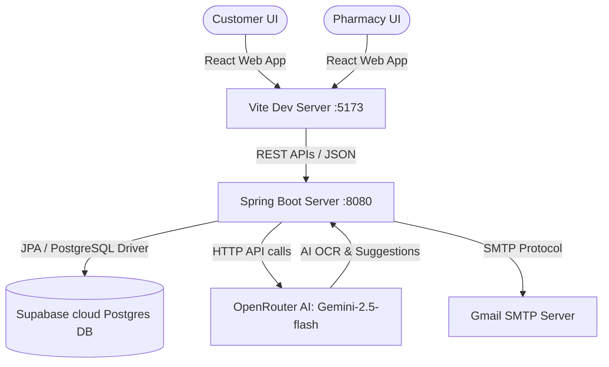

# ✙ MedFinder - Medicine Availability & AI Alternative Finder System

MedFinder is a modern, full-stack healthcare platform designed to solve medicine availability challenges. It connects customers with local pharmacies, tracks live inventory, scans paper prescriptions using AI, and suggests therapeutic alternatives when medicines are out of stock.

---

## 🌟 Key Features

### 👤 Customer Dashboard
- 🔍 **Smart Medicine Search**: Lookup medicine brand names across a network of pharmacies.
- 🔄 **AI Alternative Finder**: If a medicine is out of stock, MedFinder automatically falls back to:
  1. **Generic Alternatives**: Identifies local medicines sharing the exact active ingredient.
  2. **Disease Search**: Matches symptoms to therapeutic equivalents in the database.
  3. **Google Gemini Suggestions**: Queries AI to recommend therapeutic alternatives.
- 📄 **AI Prescription Scanner**: Upload handwritten or printed prescriptions. The integrated vision model extracts medicine names and maps them to:
  - 🟢 **Green Chip**: Available in stock nearby.
  - 🔴 **Red Chip**: Out of stock (click to instantly search alternatives).
- 🗺️ **GPS Location & Mapping**: Track device location or search by city. View nearby stores on an interactive OpenStreetMap.
- 💳 **Secure Payment & Reservation**: Reserve medicine for pick up or home delivery. Pay instantly using Debit/Credit cards, UPI (generates a dynamic QR code), or select Cash on Counter (COD).

### 🏪 Pharmacy / Admin Panel
- 🛒 **Order Tracker**: Manage home delivery and counter pick up orders. Transition statuses seamlessly (`CONFIRMED` ➔ `SHIPPED` ➔ `DELIVERED`).
- 📦 **Live Inventory**: Update stocks, configure pricing, and add new medicines to the global catalog.
- 👥 **Customer Directory**: View engagement metrics, lifetime spending (₹), and automatically badge loyal buyers with a `Top Buyer` tag.
- 🔔 **Alert HubCenter**: Real-time notifications for new reservations and low stock alerts.

---

## 🛠️ Technology Stack

### Frontend
- **Framework**: React 19 (via Vite)
- **Styling**: Glassmorphism and Custom CSS (Harmonious Dark/Light themes)
- **Maps**: Leaflet.js & OpenStreetMap
- **Icons**: React Icons (FontAwesome, etc.)
- **Http Client**: Axios

### Backend
- **Framework**: Spring Boot 3.x
- **Language**: Java 17
- **Database**: PostgreSQL (Hosted on Supabase Cloud)
- **ORM**: Spring Data JPA & Hibernate
- **AI Integrations**: OpenRouter API (utilizing `google/gemini-2.5-flash` for vision OCR and alternatives generation)
- **Mail Services**: JavaMailSender (handles automated email alerts)

---

## ⚙️ Project Architecture



---

## 🚀 Getting Started

### Prerequisites
- Node.js (v18+)
- Java JDK 17
- Maven (v3.8+)

---

### 1. Backend Setup (Spring Boot)

1. Navigate to the backend directory:
   ```bash
   cd medfinder-backend
   ```
2. Open `src/main/resources/application.properties` and configure your credentials:
   ```properties
   # Supabase Database URL
   spring.datasource.url=jdbc:postgresql://your-supabase-db-url:5432/postgres
   spring.datasource.username=postgres.your_username
   spring.datasource.password=your_password
   
   # Gmail SMTP for notifications
   spring.mail.username=your_email@gmail.com
   spring.mail.password=your_app_password
   
   # OpenRouter API Key for Gemini AI Scanner
   ai.openrouter.api.key=your_openrouter_api_key
   ```
3. Run the Spring Boot application using Maven wrapper:
   ```bash
   ./mvnw spring-boot:run
   ```
   *The server will start on port `8080`.*

---

### 2. Frontend Setup (React + Vite)

1. Navigate to the frontend directory:
   ```bash
   cd medfinder-frontend
   ```
2. Install the required Node packages:
   ```bash
   npm install
   ```
3. Start the local development server:
   ```bash
   npm run dev
   ```
   *Open [http://localhost:5173](http://localhost:5173) in your web browser.*

---

### 📦 Building for Production

To create an optimized production bundle:
```bash
npm run build
```
The compiled assets will be placed inside the `dist/` directory.

---

## 👥 Authors
- **Pranav** - Lead Developer

---

## 📄 License
This project is licensed under the MIT License.
