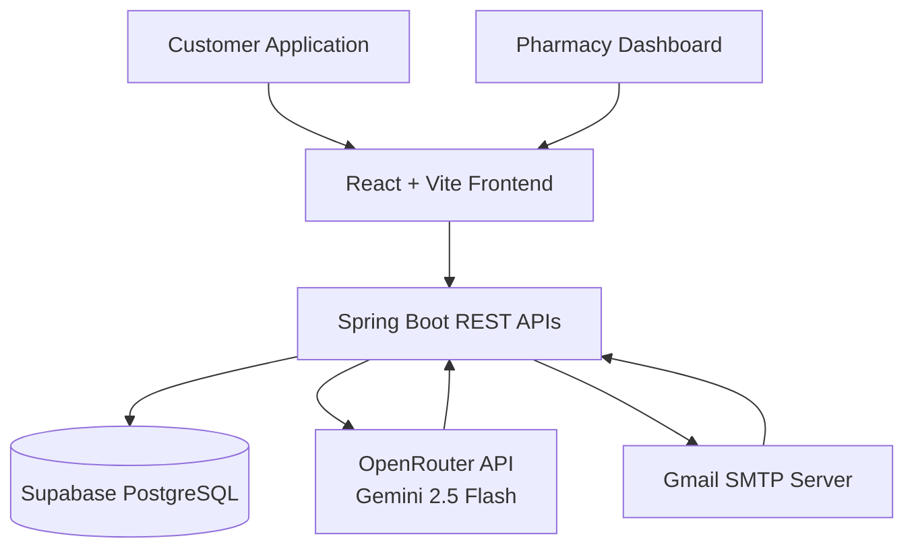

# 💊 MedFinder

### AI-Powered Medicine Availability & Alternative Finder Platform

<p align="center">
  
  
  
  
  
</p>

<p align="center">
  <b>Connecting Patients and Pharmacies Through Real-Time Inventory Intelligence, AI Prescription Analysis, and Smart Medicine Recommendations.</b>
</p>

---

## 📌 About The Project

**MedFinder** is an intelligent healthcare platform designed to simplify the process of finding medicines and connecting patients with nearby pharmacies.

The platform leverages **Artificial Intelligence**, **Real-Time Inventory Management**, and **Location-Based Services** to help users instantly locate medicines, discover suitable alternatives, scan prescriptions, and reserve medicines online.

By bridging the information gap between pharmacies and consumers, MedFinder reduces medicine search time, improves accessibility, and enhances patient care.

---

## 🚨 Problem Statement

Medicine shortages remain a significant challenge across many regions.

Patients frequently encounter situations where:

* Medicines are unavailable at nearby pharmacies.
* There is no centralized visibility of pharmacy inventories.
* Alternative medicines are difficult to identify.
* Emergency treatment is delayed due to stock shortages.
* Rural communities struggle to locate essential medicines.

These challenges result in wasted time, increased costs, and potential health risks.

---

## 💡 Solution

MedFinder provides a unified digital platform that enables:

✔ Real-Time Medicine Availability Tracking

✔ AI-Powered Alternative Medicine Recommendations

✔ Prescription Scanning using Vision AI

✔ Nearby Pharmacy Discovery via GPS

✔ Online Medicine Reservation & Ordering

✔ Pharmacy Inventory & Customer Management

---

# ✨ Core Features

## 👤 Customer Portal

### 🔍 Smart Medicine Search

Search medicines across multiple registered pharmacies and instantly view:

* Availability Status
* Pharmacy Details
* Pricing Information
* Distance from User Location

---

### 🤖 AI Alternative Recommendation Engine

When a medicine is unavailable, MedFinder automatically performs a three-level recommendation process:

#### Level 1 — Generic Matching

Identifies medicines containing the same active ingredient.

#### Level 2 — Therapeutic Matching

Suggests medicines used for treating the same condition.

#### Level 3 — AI Recommendation

Uses Google Gemini AI to generate intelligent alternative suggestions.

---

### 📄 AI Prescription Scanner

Upload handwritten or printed prescriptions.

The integrated AI Vision model:

* Extracts medicine names automatically
* Detects prescription content
* Matches medicines against pharmacy inventory
* Identifies unavailable medicines

#### Availability Indicators

🟢 Available Nearby

🔴 Out of Stock

🔄 Alternative Suggestions Available

---

### 📍 Location Intelligence

Integrated GPS and mapping services allow users to:

* Detect current location
* Search medicines by city
* View nearby pharmacies
* Calculate pharmacy distance
* Navigate using interactive maps

Powered by OpenStreetMap & Leaflet.js.

---

### 💳 Secure Ordering & Reservation

Users can:

* Reserve medicines
* Schedule pharmacy pickup
* Request home delivery

Supported payment methods:

* UPI QR Payments
* Credit Cards
* Debit Cards
* Cash on Delivery (COD)

---

## 🏪 Pharmacy Management Portal

### 📦 Inventory Management

Pharmacies can:

* Add medicines
* Update stock levels
* Modify pricing
* Monitor inventory health

---

### 🛒 Order Lifecycle Management

Track every order through its complete journey.

```text
CONFIRMED → PROCESSING → SHIPPED → DELIVERED
```

---

### 👥 Customer Insights

Monitor:

* Customer Purchase History
* Lifetime Spending
* Order Frequency
* Loyalty Metrics

Automatic recognition of:

🏆 Top Buyers

⭐ Frequent Customers

---

### 🔔 Smart Notification Center

Receive real-time alerts for:

* New Reservations
* New Orders
* Low Stock Medicines
* Delivery Updates

Email notifications are automatically generated through Gmail SMTP integration.

---

# 🏗️ System Architecture



---

# 🛠️ Technology Stack

| Layer         | Technologies                     |
| ------------- | -------------------------------- |
| Frontend      | React 19, Vite, Axios            |
| UI Design     | Glassmorphism, Responsive CSS    |
| Mapping       | Leaflet.js, OpenStreetMap        |
| Backend       | Spring Boot 3.x, Java 17         |
| Database      | PostgreSQL (Supabase)            |
| ORM           | Hibernate, Spring Data JPA       |
| AI Services   | OpenRouter API, Gemini 2.5 Flash |
| OCR Engine    | Gemini Vision Model              |
| Notifications | JavaMailSender, Gmail SMTP       |

---

# 🚀 Installation

## Clone Repository

```bash
git clone https://github.com/your-username/MedFinder.git
cd MedFinder
```

---

## Backend Setup

```bash
cd medfinder-backend
```

Configure:

```properties
spring.datasource.url=
spring.datasource.username=
spring.datasource.password=

spring.mail.username=
spring.mail.password=

ai.openrouter.api.key=
```

Run Backend:

```bash
./mvnw spring-boot:run
```

Backend URL:

```text
http://localhost:8080
```

---

## Frontend Setup

```bash
cd medfinder-frontend
npm install
npm run dev
```

Frontend URL:

```text
http://localhost:5173
```

---

# 📊 Key Benefits

### For Customers

* Faster Medicine Discovery
* Reduced Search Time
* AI-Based Recommendations
* Convenient Reservations
* Improved Accessibility

### For Pharmacies

* Increased Visibility
* Better Inventory Control
* Improved Customer Engagement
* Automated Notifications
* Digital Order Management

---

# 🔮 Future Scope

* Mobile Application (Android & iOS)
* Hospital & Clinic Integration
* AI Health Assistant
* Voice-Based Medicine Search
* Multi-Language Support
* Emergency Medicine Locator
* Predictive Inventory Analytics
* Electronic Health Record Integration

---

# 👨‍💻 Developer

### Pranav Sali

Full Stack Developer | AI Enthusiast | Healthcare Technology Innovator

---

# 📜 License

Distributed under the MIT License.

---

## ⭐ Support

If you found this project useful, consider giving it a **Star ⭐** on GitHub.

Your support helps improve and expand the platform for better healthcare accessibility.
